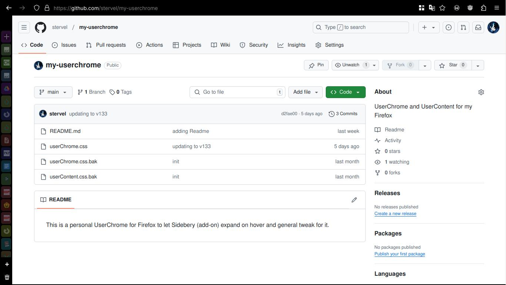

This is a personal UserChrome for Firefox.

[]

Changes:
- Hides the top tab bar (so that it's Sidebery oriented).
- Hides sidebar header.
- Makes Sidebery bar auto-minimizes (the value can be changed accordingly) and expand on hover.
- Adds 0.6 s delay before reminimizes.
